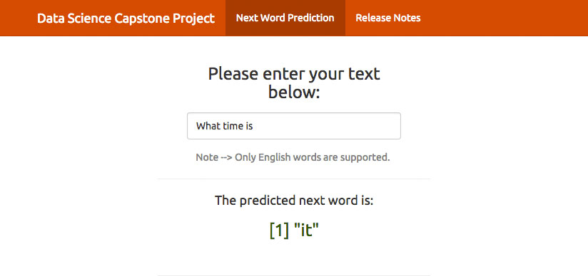

Coursera Data Science Capstone Project:
========================================================

author: Geoff Freedman

This is an overview of the PredictEngine web app [application](https://mrttackfrog.shinyapps.io/PredictEngine) for predicting the next word in a sequence of words. The app uses an N-Gram prediction model taken from the field of natural language processing.

02/05 Functionality Of This App:
========================================================

* The main goal of this project is to build a web app that predict's the next word after a sequence of inputted words.
* The app has a rudimentary prediction engine like the one used in mobile phones that predict the next word you might type:

03/05 How To Use The App:
========================================================

* Type (or copy and paste) in a word or phrase into the input text box on the main screen of the app. 
* The web app will detect that something new has been entered into the text box and it'll run your text input through it's prediction engine. 
* Each time the input changes, the app will try to make a prediction.

04/05 How It Works Under The Hood:
========================================================

* The data used to create the word-frequency dictionary originated in text a corpus called [HC Corpora](http://www.corpora.heliohost.org/).
* The basic algorithm to produce a word prediction is as follows:
* 01) Create a sample data set from the corpus
* 02) Clean the sample (convert it to lowercase, remove punctuation, strip whitespace, remove entities, etc.) 
* 03) Tokenize the sample into N-Grams (see below for more on N-Grams)
* 04) Take the uni/bi/tri and quadram frequencies and put them into lookup data frames
* 05) Use the data frame to predict the next word in the inputted sequence.

05/05 Github and Notes:
========================================================

* The next word prediction app is hosted on shinyapps.io: [https://mrttackfrog.shinyapps.io/PredictEngine](https://mrttackfrog.shinyapps.io/PredictEngine)

* You can view the GitHub repository needed to build the web app: [https://github.com/gfreedman/ShinyApp](https://github.com/gfreedman/ShinyApp)

* What is an N-Gram? -->  [N-Grams](http://en.wikipedia.org/wiki/N-gram). 

*  *"In the fields of computational linguistics and probability, an N-Grams is a contiguous sequence of n items from a given sequence of text or speech." ([Wikipedia](http://en.wikipedia.org/wiki/N-gram))*
